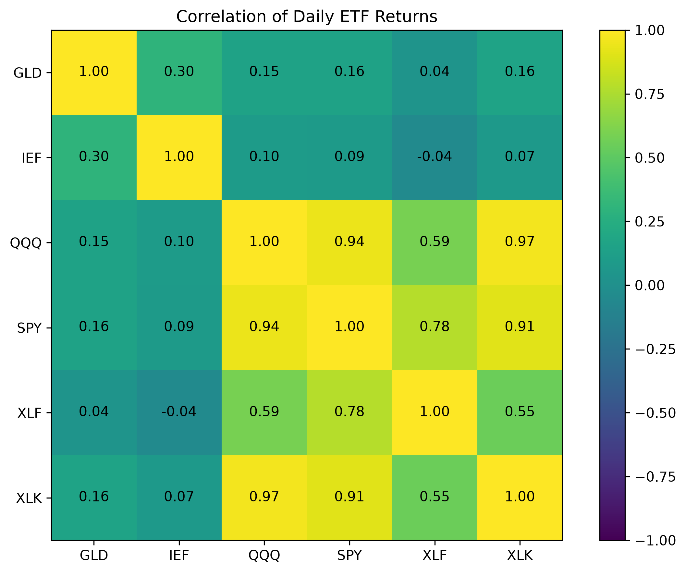
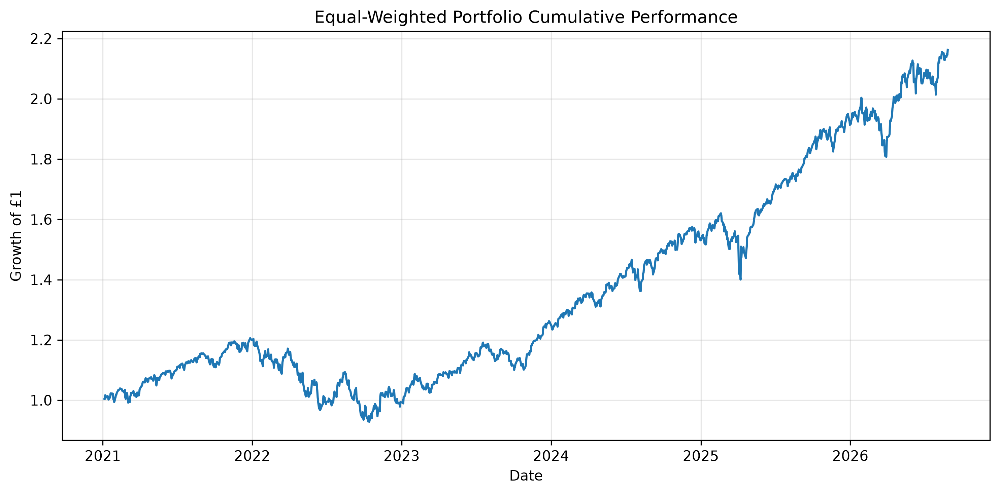
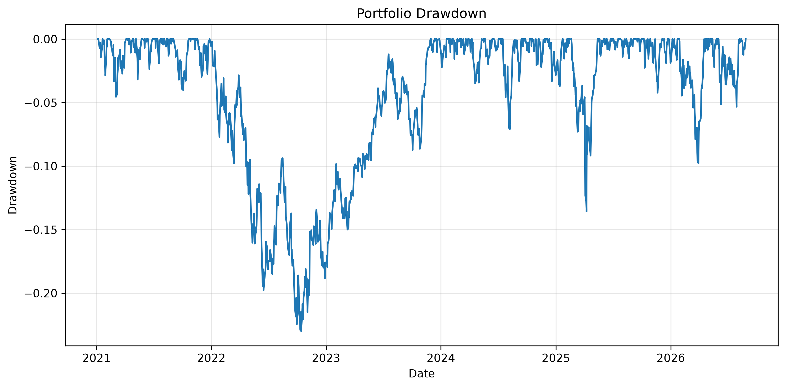

# Portfolio Risk & Market Analysis

A Python and SQL project analysing the risk and performance characteristics of a multi-asset ETF portfolio.

## Overview

This project examines how diversification affects portfolio risk using six ETFs representing different market exposures:

- SPY — broad US equities
- QQQ — Nasdaq-100 equities
- XLF — financial-sector equities
- XLK — technology-sector equities
- GLD — gold
- IEF — US Treasury bonds
The analysis compares individual asset behaviour with an equal-weight portfolio and evaluates both total and downside risk.

## Analysis

The project covers:

- Historical market data processing
- Daily and annualised returns
- Volatility and variance
- Correlation and covariance
- SQL-based return analysis
- Portfolio construction
- Cumulative performance
- Maximum drawdown
- Historical Value at Risk (VaR)
- Expected Shortfall (CVaR)
- Sharpe ratio
- Market beta

## Key Results

The equal-weight portfolio produced:

- Annualised return: 14.60%
- Annualised volatility: 13.70%
- Sharpe ratio: 0.77
- Maximum drawdown: -23.00%
- 95% one-day historical VaR: -1.34%
- 95% Expected Shortfall: -1.93%
- Market beta: 0.79

The analysis found that highly correlated equity exposures such as QQQ and XLK provided relatively limited diversification, while GLD and IEF behaved more independently from equities.
The equal-weight portfolio achieved a higher historical Sharpe ratio than any individual ETF in the sample, illustrating how diversification can improve risk-adjusted performance even without maximising raw return.

## Visualisations

### Asset Correlations



### Portfolio Performance



### Portfolio Drawdown



## Tools

- Python
- pandas
- NumPy
- matplotlib
- SQLite / SQL
- yfinance
- Jupyter Notebook

## Limitations

Results are based on historical data and should not be interpreted as forecasts. The analysis assumes equal portfolio weights, regular rebalancing and a constant 4% annual risk-free rate. Transaction costs and taxes are excluded.

## Repository Structure

```text
portfolio_risk_analysis/
├── figures/
├── portfolio_analysis.ipynb
├── requirements.txt
├── README.md
├── .gitignore
└── LICENSE
